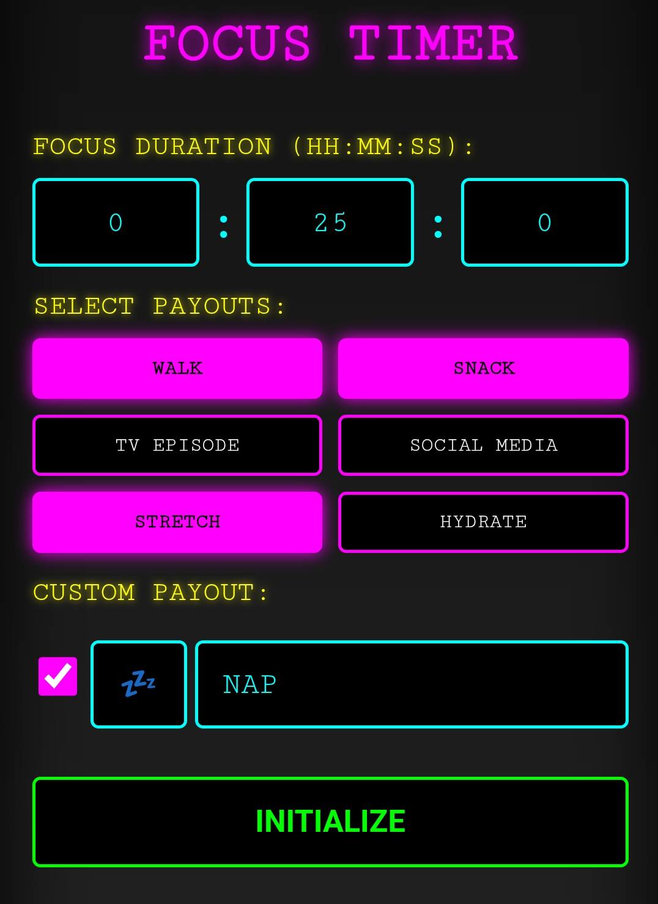
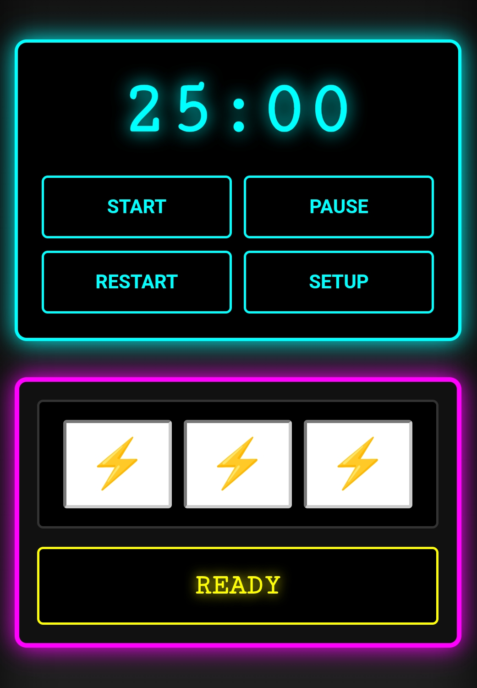
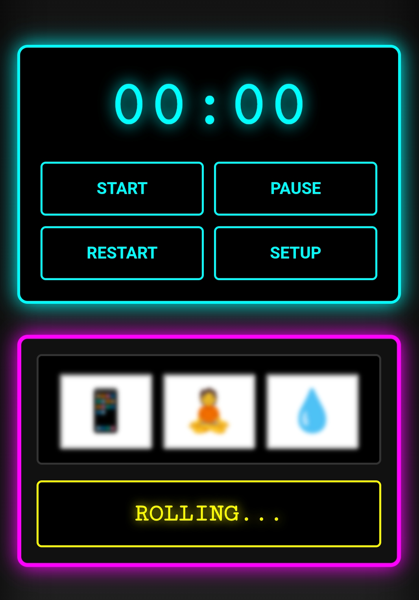
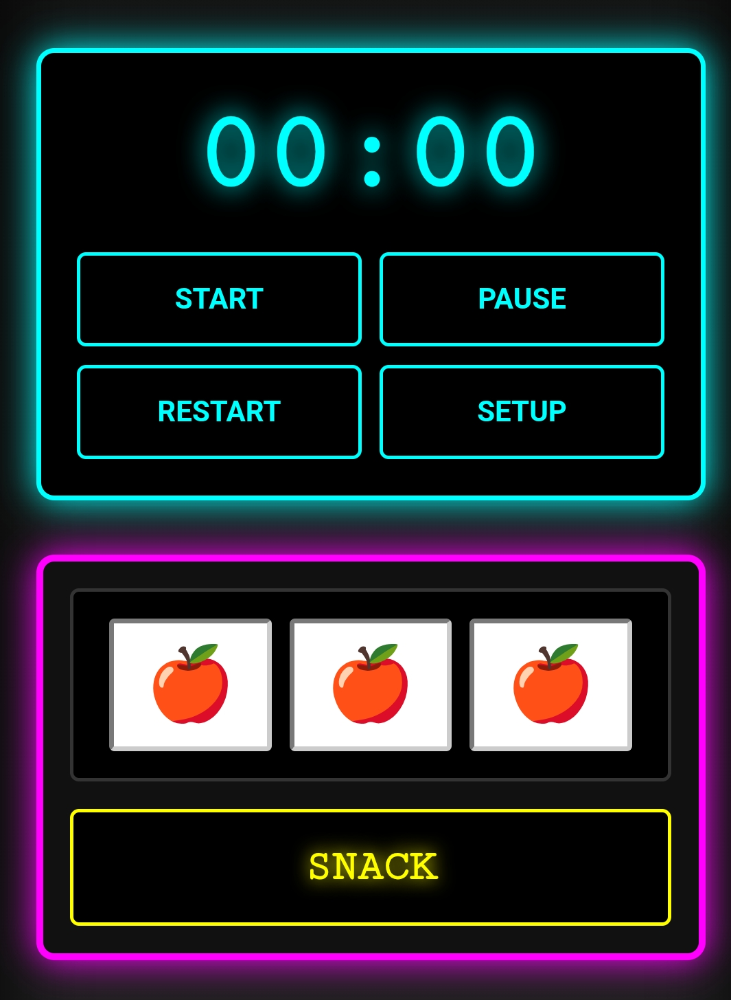

# Focus Timer

[Live Application](https://benjulius.github.io/focus-timer)

A mobile-responsive timer that uses a slot machine mechanic to determine break activities.

## Screenshots

| Machine Setup | Active Timer |
|:---:|:---:|
|  |  |

| Spin Animation | Reward Payout |
|:---:|:---:|
|  |  |

## Tech Stack

  
  
  

## Features

- Custom duration settings for hours, minutes, and seconds.
- Integrated slot machine reel animations upon timer completion.
- Selectable reward payouts with a built-in emoji picker for custom entries.
- Restart and reset functionality.
- Responsive design optimized for mobile and desktop use.

## Technical Details

Built with vanilla JavaScript, HTML5, and CSS3. The application uses a class-based structure for timer logic and reel animations. No external libraries or frameworks are required.

## Installation

1. Clone the repository:
   git clone https://github.com/BenJulius/focus-timer.git

2. Navigate to the directory:
   cd focus-timer

3. Open index.html in a web browser.

## License

This project is licensed under the MIT License.
